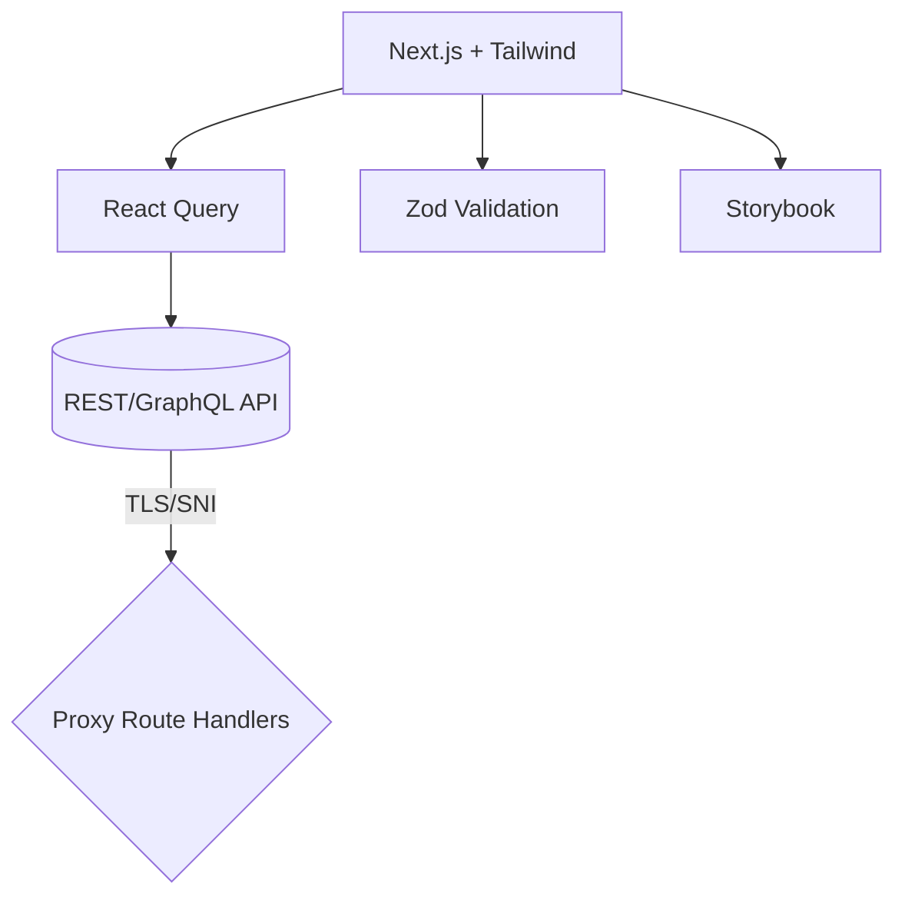

# Frontend README

---

## 🏷️ 프로젝트 개요

* **프로젝트명**: *결제지킴이*
* **설명**: *사기 거래 탐지를 위한 웹사이트입니다.*
* **배포 주소**: *[https\://smupaypro.vercel.app]*

---

## 🧰 Tech Stack

* **Framework**: Next.js (App Router)
* **Language**: TypeScript
* **Package Manager**: pnpm
* **UI**: Tailwind CSS, shadcn/ui, lucide-react
* **Form/Schema**: React Hook Form, Zod
* **Charts**: Recharts
* **Docs/UI**: Storybook
* **CI**: GitHub Actions (typecheck/test/build)

---

## 🚀 빠른 시작 (Quick Start)

```bash
# 1) 의존성 설치
pnpm install

# 2) 환경변수 설정
cp .env.example .env.local
# .env.local 내용을 수정하세요

# 3) 개발 서버
pnpm dev

# 4) 타입체크 / 테스트 / 빌드
pnpm typecheck
pnpm test
pnpm build
```

**요구사항**

* Node.js 20+
* pnpm 9+

---

## ⚙️ 스크립트

| Script                 | 설명                        |
| ---------------------- | ------------------------- |
| `pnpm dev`             | 개발 서버 시작 (`next dev`)     |
| `pnpm build`           | 프로덕션 빌드 (`next build`)    |
| `pnpm start`           | 프로덕션 서버 시작 (`next start`) |
| `pnpm typecheck`       | `tsc --noEmit` 타입 검사      |
| `pnpm test`            | 단위/컴포넌트 테스트 실행            |
| `pnpm storybook`       | 스토리북 로컬 실행                |
| `pnpm build-storybook` | 스토리북 정적 빌드                |
| `pnpm lint`            | (선택) ESLint 실행            |

> **팁**: Husky + lint-staged를 사용해 pre-commit 훅에서 `typecheck`/`test` 최소화 가능.

---

## 🗂️ 폴더 구조 (예시)

```
src/
  app/                      # Next.js App Router
    (logo-layout)/
    dashboard/
    api/                    # Route Handlers (server actions)
  components/               # 재사용 UI 컴포넌트
  features/                 # 도메인 모듈 (notification, class, auth ...)
  hooks/                    # 공용 훅
  styles/                   # Tailwind/전역 스타일
  lib/                      # 유틸/클라이언트-서버 공용 모듈
  types/                    # DTO/타입 정의(Zod 등)
public/
  assets/                   # 이미지/아이콘
```

---

## 🏛️ 아키텍처 & 의존성



* **Route Handler 가이드**

  * Web 표준 `Request/Response` 사용 권장
  * 두 번째 인자: `{ params: Record<string, string> }`
  * `DEPTH_ZERO_SELF_SIGNED_CERT` 회피: Node https.Agent + `rejectUnauthorized:false` (**운영에서는 정식 TLS 권장**)

---

## 📦 API 연동 패턴

* **인증**: `Authorization: Bearer <token>` (쿠키/헤더 → 프록시에서 병합)
* **Credentials**: CORS 간 도메인이라면 `credentials: 'include'`
* **오류 표준**: `{ timestamp, status, error, message, details }`
* **예시 코드**

```ts
export async function fetcher<T>(url: string, init?: RequestInit): Promise<T> {
  const res = await fetch(url, { ...init, credentials: 'include' });
  const text = await res.text();
  const data = text ? JSON.parse(text) : null;
  if (!res.ok) {
    const msg = data?.message || `Request failed (${res.status})`;
    throw new Error(msg);
  }
  return data as T;
}
```

---

## ⚡ 퍼포먼스 가이드

* 이미지 최적화: `next/image`
* 코드 스플리팅: 다이나믹 임포트
* React Query 캐시 전략: 키 설계, `staleTime`/`gcTime`
* 웹 번들 분석: `next build` 후 `INVESTIGATE` (babel-plugin/webpack-analyzer 옵션)

---

## 🔒 보안 베스트 프랙티스

* HTTPS/TLS (운영: 정식 인증서)
* CSP/보안 헤더 (nginx/Next config)
* XSS/CSRF 대비 (쿠키 SameSite, HttpOnly, Secure)
* 토큰 저장: 세션 쿠키 우선, 로컬스토리지 지양

---

## 🛠️ 로컬 개발 팁

* **Self-signed API**: 환경변수 `API_SNI_HOST` + Route Handler의 `https.Agent`
* **CORS**: 동일 오리진 프록시 경로(`/proxy/...`) 사용 권장
* **404/리프레시 문제**: App Router에서 동적 라우트의 `generateStaticParams`/미들웨어 제외 매처 검토

---


## 🧰 트러블슈팅

* **DEPTH\_ZERO\_SELF\_SIGNED\_CERT**: 프록시에서 `https.Agent({ rejectUnauthorized:false })` (로컬만!)
* **Route Handler 타입 에러**: `Request`/`NextResponse` 사용, 두 번째 인자 `{ params: Record<string,string> }`
* **쿠키/크레덴셜**: 교차 도메인은 `credentials:'include'` + 서버 CORS 설정
* **Next export 에러**: 동적 라우트는 `export` 불가 → 서버 런타임 필요

